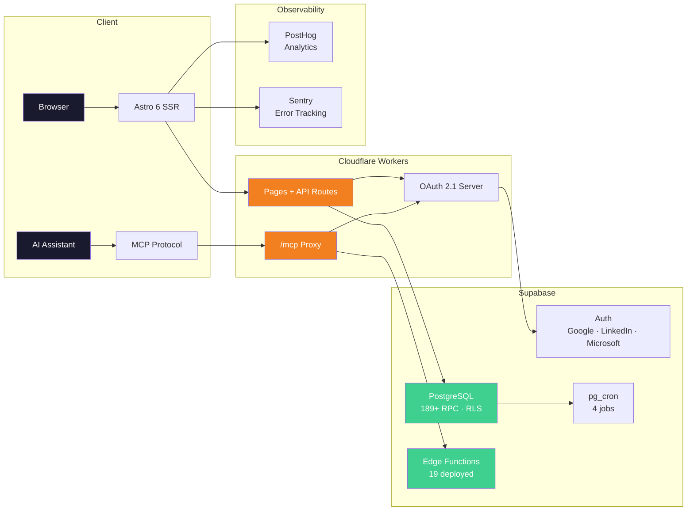
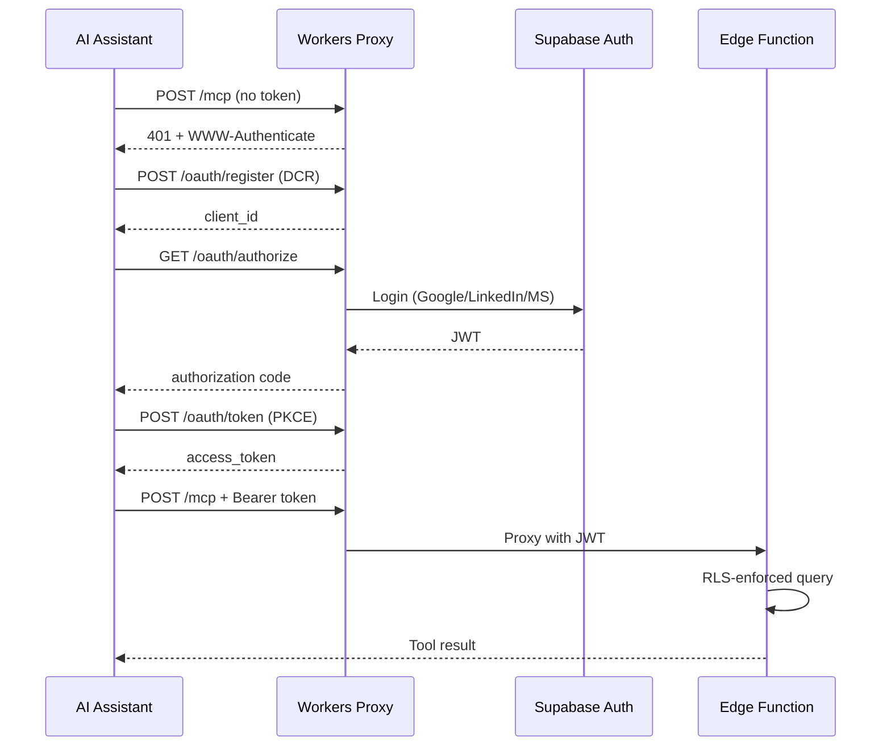

<div align="center">

# 🌐 AI & PM Research Hub

**Nucleo de Estudios e Investigacion en Inteligencia Artificial y Gestion de Proyectos**
*Una Iniciativa Conjunta de los Capitulos Brasileños del PMI*

[](LICENSE)
[](https://creativecommons.org/licenses/by-sa/4.0/)
[](https://astro.build)
[](https://react.dev)
[](https://supabase.com)
[](https://workers.cloudflare.com)
[](#servidor-mcp--integracion-con-ia)
[](https://posthog.com)
[](https://sentry.io)
[]()

[🇺🇸 English](README.md) · [🇧🇷 Português](README.pt-BR.md)

[**Plataforma**](https://nucleoia.vitormr.dev) · [**Servidor MCP**](https://nucleoia.vitormr.dev/mcp) · [**Blog**](https://nucleoia.vitormr.dev/blog) · [**Gobernanza**](docs/GOVERNANCE_CHANGELOG.md)

</div>

---

## Descripcion General

El **AI & PM Research Hub** (*Nucleo de Estudos e Pesquisa em Inteligencia Artificial e Gerenciamento de Projetos*) es una iniciativa multi-capitulo de investigacion dentro del ecosistema PMI® brasileño, dedicada a avanzar la interseccion entre Inteligencia Artificial y Gestion de Proyectos.

Fundado en 2024 como piloto en PMI Goias, el proyecto evoluciono hacia una alianza estructurada entre cinco capitulos PMI — **PMI-GO, PMI-CE, PMI-DF, PMI-MG y PMI-RS** — con 50 investigadores activos organizados en 7 lineas de investigacion y 4 cuadrantes estrategicos.

> **Director del Proyecto:** Vitor Maia Rodovalho

---

## Numeros Actuales

| Indicador | Valor |
|-----------|-------|
| Investigadores activos (Ciclo 3) | 50 |
| Lineas de investigacion (Tribos) | 7 |
| Capitulos PMI | 5 (GO · CE · DF · MG · RS) |
| Entradas de gobernanza | 135+ |
| Posts en el blog | 9 |
| Herramientas MCP | 29 (23 lectura · 6 escritura) |
| Edge Functions | 19 |
| Claves i18n | 3.500+ (3 idiomas) |
| Tests | 779 |
| Costo mensual | $0 |

---

## Cuadrantes Estrategicos

| # | Cuadrante | Lineas de Investigacion |
|---|----------|-----------------|
| Q1 | **El Practicante Aumentado** | Herramientas y Ecosistema de IA para GP |
| Q2 | **Gestion de Proyectos con IA** | Agentes Autonomos y Equipos Hibridos |
| Q3 | **Liderazgo Organizacional** | TMO y PMO del Futuro · Cultura y Cambio · Talento y Capacitacion · ROI y Portafolio |
| Q4 | **Futuro y Responsabilidad** | Gobernanza e IA Confiable · Inclusion y Colaboracion Humano-IA |

---

## Arquitectura



---

## Stack Tecnico

| Capa | Tecnologia | Detalles |
|------|-----------|---------|
| **Frontend** | Astro 6 + React 19 + Tailwind 4 | SSR con island architecture, trilingue |
| **Hospedaje** | Cloudflare Workers | SSR en el edge, proxy OAuth, proxy MCP |
| **Base de Datos** | Supabase PostgreSQL | 189+ funciones SECURITY DEFINER, RLS |
| **Auth** | Google + LinkedIn + Microsoft | OAuth 2.1, PKCE, registro dinamico de clientes |
| **MCP** | Servidor personalizado (50 herramientas) | Asistentes de IA consultan la plataforma via lenguaje natural |
| **Logica Server** | Supabase Edge Functions (19) | Sync Credly, asistencia, MCP, campañas, PostHog proxy |
| **Analytics** | PostHog | Analytics de producto, session replay |
| **Errores** | Sentry | Monitoreo de errores en tiempo real |
| **Cron** | pg_cron (4 jobs) | Sync Credly, asistencia, alertas detractores, recordatorios |
| **DnD** | @dnd-kit | BoardEngine Kanban |
| **Rich Text** | TipTap | Actas de reunion, editor de blog |

---

## Servidor MCP — Integracion con IA

Cualquier miembro puede conectar Claude, ChatGPT, Perplexity, Cursor o VS Code a la plataforma via Model Context Protocol. 50 herramientas (43 lectura + 7 escritura) autenticadas via OAuth 2.1 con Row Level Security. Auto-refresh server-side mantiene sesiones activas por hasta 30 dias sin reconexion manual. Capa de conocimiento dinamica adapta orientaciones al rol y permisos de cada miembro.

```
https://nucleoia.vitormr.dev/mcp
```



| Compatibilidad | Estado |
|----------------|--------|
| Claude.ai | Verificado (50 herramientas) |
| Claude Code | Verificado |
| ChatGPT | Verificado (beta) |
| Perplexity | Verificado |
| Cursor / VS Code | Verificado |
| Manus AI | Verificado (JSON import) |

**[Guia de Configuracion MCP](docs/MCP_SETUP_GUIDE.md)**

---

## Funcionalidades

### Para Investigadores
- Workspace personal con XP, ranking y seguimiento de badges Credly
- Dashboard de la tribu con reuniones, asistencia y entregas
- BoardEngine (Kanban, tabla, calendario, timeline, vista agrupada)
- Gamificacion con 10 categorias de XP
- Interfaz trilingue (PT-BR · EN-US · ES-LATAM)

### Para Lideres de Tribu
- Gestion completa del board (crear, asignar, mover, archivar)
- Registro y reportes de asistencia
- Actas de reunion (editor rich text TipTap)
- Notificaciones y broadcast para la tribu

### Para Administracion
- Panel admin con dashboards de KPI y gobernanza
- 28+ Change Requests rastreando actualizaciones manuales
- Landing page para stakeholders
- Proceso de seleccion con revision ciega
- CRUD de sostenibilidad con proyecciones financieras

---

## Gobernanza

Este proyecto opera bajo un modelo formal de gobernanza con niveles jerarquicos de acceso, un comite de revision por pares (*Comite de Curadoria*), y procesos selectivos basados en merito. Todas las decisiones se rastrean en el changelog.

- [Changelog de Gobernanza](docs/GOVERNANCE_CHANGELOG.md) — 135+ entradas (GC-001 a GC-135+)
- [Board de Sprints](https://github.com/users/VitorMRodovalho/projects/1/)
- [Guia de Contribucion](CONTRIBUTING.md)

---

## Principios de Arquitectura

1. **Costo Cero, Alto Valor** — Toda la infraestructura en free tiers (Supabase, Cloudflare, PostHog, Sentry)
2. **Plataforma como Fuente de Verdad** — Estado de miembros, gamificacion, gobernanza y producciones de investigacion viven aqui
3. **Seguridad por Diseño** — Todas las escrituras via RPCs SECURITY DEFINER, RLS por miembro/tribu/rol, conformidad LGPD
4. **Centralizacion de Datos** — Agendas, links, slots de reunion en la base de datos — nunca hardcoded

---

## Desarrollo Local

```bash
npm install
npm run build
npm run dev -- --host 0.0.0.0 --port 4321
npm test
```

**Prerrequisitos:** Node.js 24+ (nvm), Supabase CLI, Wrangler CLI. Ver `.env.example` para variables.

---

## Estructura del Repositorio

```
├── src/
│   ├── pages/          # Paginas Astro (rutas trilingues)
│   ├── components/     # React islands + componentes Astro
│   ├── lib/            # Cliente Supabase, auth, utilitarios
│   └── middleware/      # CSP, auth, i18n
├── supabase/
│   ├── functions/      # 19 Edge Functions
│   └── migrations/     # Migraciones de base de datos
├── tests/              # 779 tests pasando
├── docs/               # Gobernanza, guias, specs
└── scripts/            # Scripts de auditoria y utilitarios
```

---

## Documentacion

| Documento | Proposito |
|----------|---------|
| [`README.md`](README.md) | Punto de entrada del proyecto (EN) |
| [`README.pt-BR.md`](README.pt-BR.md) | Versao em Portugues |
| [`README.es.md`](README.es.md) | Version en Espanol |
| [`CONTRIBUTING.md`](CONTRIBUTING.md) | Como contribuir |
| [`AGENTS.md`](AGENTS.md) | Contexto para asistentes de IA |
| [`docs/GOVERNANCE_CHANGELOG.md`](docs/GOVERNANCE_CHANGELOG.md) | Todas las decisiones de gobernanza |
| [`docs/MCP_SETUP_GUIDE.md`](docs/MCP_SETUP_GUIDE.md) | Configuracion del servidor MCP |
| [`docs/BOARD_ENGINE_SPEC.md`](docs/BOARD_ENGINE_SPEC.md) | Arquitectura del BoardEngine |
| [`docs/DISASTER_RECOVERY.md`](docs/DISASTER_RECOVERY.md) | Backup y recuperacion |

---

## Licencia

Codigo licenciado bajo [MIT](LICENSE).
Documentacion licenciada bajo [CC BY-SA 4.0](https://creativecommons.org/licenses/by-sa/4.0/).

PMI®, PMBOK®, PMP® y PMI-CPMAI™ son marcas registradas del Project Management Institute, Inc.
Esta iniciativa es un proyecto colaborativo de capitulos PMI independientes y no esta directamente afiliada ni endosada por PMI Global.
