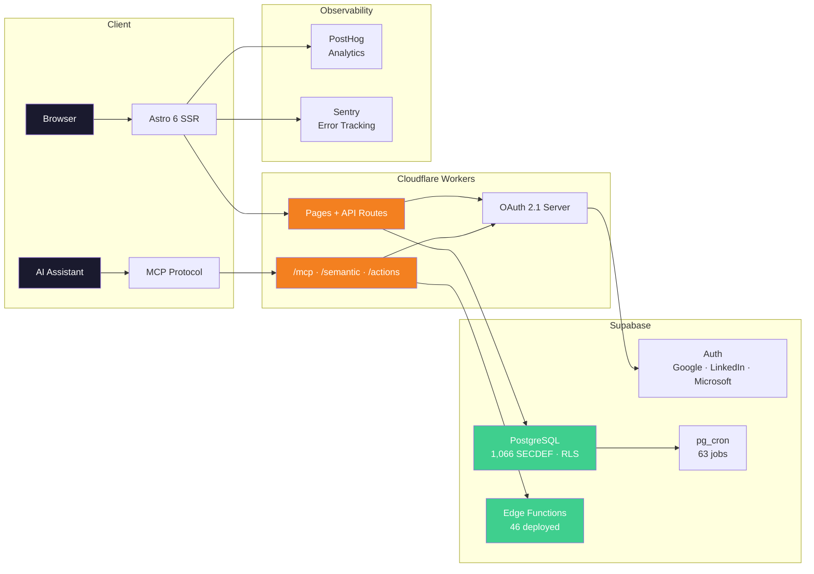
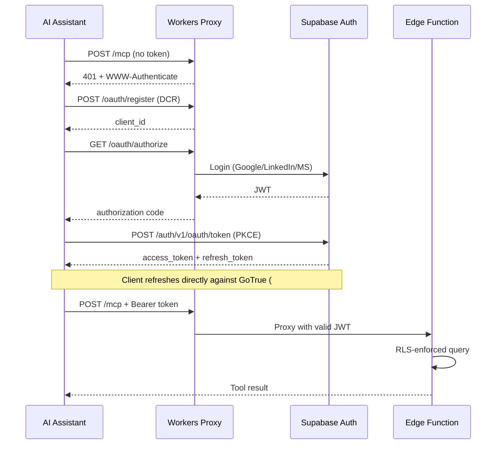

<div align="center">

# 🌐 AI & PM Research Hub

**The AI & Project Management Study and Research Hub**
*A Joint Initiative of the PMI Brazilian Chapters*

[](LICENSE)
[](LICENSE-docs)
[](https://astro.build)
[](https://react.dev)
[](https://supabase.com)
[](https://workers.cloudflare.com)
[](#mcp-server--ai-integration)
[](https://posthog.com)
[](https://sentry.io)
[]()

[🇧🇷 Português](README.pt-BR.md) · [🇪🇸 Español](README.es.md)

[**Live Platform**](https://nucleoia.vitormr.dev) · [**MCP Server**](https://nucleoia.vitormr.dev/mcp) · [**Blog**](https://nucleoia.vitormr.dev/blog) · [**Governance**](https://nucleoia.vitormr.dev/governance) · [**Site Map & Access Tiers**](docs/SITE_MAP.md)

</div>

---

## Overview

The **AI & PM Research Hub** (*Núcleo de Estudos e Pesquisa em Inteligência Artificial e Gerenciamento de Projetos*) is a multi-chapter research initiative under the PMI® Brazilian ecosystem, advancing the intersection of Artificial Intelligence and Project Management.

Founded in 2024 as a pilot within PMI Goiás, the initiative has grown into a structured alliance of five PMI chapters — **PMI-GO, PMI-CE, PMI-DF, PMI-MG, and PMI-RS** — with 52 active researchers organized across 7 research streams and 4 strategic knowledge quadrants.

> **Project Manager:** Vitor Maia Rodovalho

---

## Key Numbers

| Indicator | Value |
|-----------|-------|
| Active researchers (Cycle 3) | 52 |
| Research streams (Tribos) | 7 |
| PMI chapters | 5 (GO · CE · DF · MG · RS) |
| Events held | 209 |
| Governance entries | 141+ (GC-001 → GC-141+) |
| Blog posts | 9 |
| MCP surfaces | `/mcp` 342 registry · `/semantic` 52 intent · `/actions` 88 overflow |
| Edge Functions | 46 |
| pg_cron jobs | 63 |
| RPCs (SECURITY DEFINER) | 1,066 (1,228 public functions total) |
| i18n keys | 6,700+ (3 locales) |
| Tests | 5,306 passing (5,839 total; DB-aware suite runs with service-role env) |
| Monthly cost | $0 |

---

## Strategic Knowledge Quadrants

| # | Quadrant | Research Streams |
|---|----------|-----------------|
| Q1 | **The Augmented Practitioner** | AI Tools & Ecosystem for PM |
| Q2 | **AI Project Management** | Autonomous Agents & Hybrid Teams |
| Q3 | **Organizational Leadership** | TMO & PMO of the Future · Culture & Change · Talent & Upskilling · ROI & Portfolio |
| Q4 | **Future & Responsibility** | Governance & Trustworthy AI · Inclusion & Human-AI Collaboration |

---

## Architecture



---

## Technical Stack

| Layer | Technology | Details |
|-------|-----------|---------|
| **Frontend** | Astro 6 + React 19 + Tailwind 4 | SSR with island architecture, trilingual |
| **Hosting** | Cloudflare Workers | Edge SSR, OAuth proxy, MCP proxy |
| **Database** | Supabase PostgreSQL | 1,066 SECURITY DEFINER functions, RLS |
| **Auth** | Google + LinkedIn + Microsoft | OAuth 2.1, PKCE, native Supabase OAuth server (#1210) |
| **MCP** | Custom server, 3 surfaces | `/mcp` (342 registry) · `/semantic` (52 intent-level, SPEC-280) · `/actions` (88 overflow for the 256/connector cap) |
| **Server Logic** | Supabase Edge Functions (46) | Credly sync, attendance, MCP, campaigns, Artia sync, PostHog proxy, AI triage |
| **Analytics** | PostHog | Product analytics, session replay |
| **Errors** | Sentry | Real-time error monitoring |
| **Cron** | pg_cron (63 jobs) | Credly sync, attendance batch, detractor alerts, weekly digests (member · leader · tribe), MCP anomaly detection, LGPD anonymize, log retention, R2 backup, AI retry queues, Artia sync, drive-discover-atas, V4 engagement expiry/anonymize |
| **DnD** | @dnd-kit | BoardEngine Kanban |
| **Rich Text** | TipTap | Meeting minutes, blog editor |

---

## MCP Server — AI Integration

Any member can connect Claude, ChatGPT, Perplexity, Cursor, or VS Code to the platform via the Model Context Protocol. All tools are authenticated via OAuth 2.1 (Supabase's native OAuth server, #1210 — the AI client refreshes directly against Supabase Auth on a client-scoped chain, independent of the browser session) with full Row Level Security enforcement.

The server exposes **three surfaces** (live counts at `/health`; the `tools/list` response is the source of truth, never pin a number):

| Surface | URL | Tools | Purpose |
|---------|-----|-------|---------|
| **`/mcp`** | `nucleoia.vitormr.dev/mcp` | 342 | Full internal capability registry. Default for clients that accept large catalogs. |
| **`/semantic`** | `nucleoia.vitormr.dev/mcp/semantic` | 52 | Intent-level semantic gateway (SPEC-280 / #1383). One tool per user intent (~7:1 consolidation) with a stable envelope `{ok,data,summary,warnings,next_actions,audit}`; writes carry authority + confidential-visibility gates as a contract. Use when a strict client rejects the full catalog. |
| **`/actions`** | `nucleoia.vitormr.dev/mcp/actions` | 88 | Overflow surface for the Claude connector's 256-tool-per-connector cap (#1377) — re-exposes the write/action tail the alphabetical cut would drop. Consumed alongside `/mcp` as a second connector. |

```
https://nucleoia.vitormr.dev/mcp
```



| Compatibility | Status |
|--------------|--------|
| Claude.ai | Verified |
| Claude Code | Verified |
| ChatGPT | Verified (beta) |
| Perplexity | Verified |
| Cursor / VS Code | Verified |
| Manus AI | Verified (JSON import) |

**[MCP Setup Guide](docs/MCP_SETUP_GUIDE.md)**

---

## Key Features

### For Researchers
- Personal workspace with XP, ranking, and Credly badge tracking
- Tribe dashboard with meetings, attendance, and deliverables
- BoardEngine (Kanban, table, calendar, timeline, grouped views)
- Gamification with 10 XP categories
- Trilingual interface (PT-BR · EN-US · ES-LATAM)

### For Tribe Leaders
- Full board management (create, assign, move, archive)
- Attendance registration and reporting
- Meeting minutes (TipTap rich text)
- Tribe notifications and broadcast

### For Administration
- Admin panel with KPI dashboards and governance
- 28+ Change Requests tracking manual updates
- Stakeholder landing page
- Selection process with blind review
- Sustainability CRUD with financial projections

---

## Governance

This project operates under a formal governance model with hierarchical access tiers, a peer review committee (*Comitê de Curadoria*), and merit-based selection processes. All decisions tracked in the changelog.

- [Governance Changelog](docs/GOVERNANCE_CHANGELOG.md) — 141+ entries (GC-001 → GC-141+)
- [Sprint Board](https://github.com/users/VitorMRodovalho/projects/1/)
- [Contributing Guide](CONTRIBUTING.md)

---

## Architecture Principles

1. **Zero-Cost, High-Value** — All infrastructure on free tiers (Supabase, Cloudflare, PostHog, Sentry)
2. **Platform as Source of Truth** — Member state, gamification, governance, and research outputs live here
3. **Security by Design** — All writes via SECURITY DEFINER RPCs, RLS per member/tribe/role, LGPD compliant
4. **Data Centralization** — Schedules, links, meeting slots in the database — never hardcoded

---

## Local Development

```bash
npm install
npm run build
npm run dev -- --host 0.0.0.0 --port 4321
npm test
```

**Prerequisites:** Node.js 24+ (nvm), Supabase CLI (**≥ 2.100.1** — earlier versions fork-bomb on `migration repair`, see issue #155 / `docs/RUNBOOK.md`), Wrangler CLI. See `.env.example` for variables.

---

## Repository Structure

```
├── src/
│   ├── pages/          # Astro pages (trilingual routes)
│   ├── components/     # React islands + Astro components
│   ├── lib/            # Supabase client, auth, utilities
│   └── middleware/      # CSP, auth, i18n
├── supabase/
│   ├── functions/      # 46 Edge Functions
│   └── migrations/     # Database migrations
├── tests/              # 5,306 passing tests
├── docs/               # Governance, guides, specs
└── scripts/            # Audit and utility scripts
```

---

## Documentation

| Document | Purpose |
|----------|---------|
| [`README.md`](README.md) | Project entry point (EN) |
| [`README.pt-BR.md`](README.pt-BR.md) | Versao em Portugues |
| [`README.es.md`](README.es.md) | Version en Espanol |
| [`CONTRIBUTING.md`](CONTRIBUTING.md) | How to contribute |
| [`AGENTS.md`](AGENTS.md) | Context for AI assistants |
| [`docs/GOVERNANCE_CHANGELOG.md`](docs/GOVERNANCE_CHANGELOG.md) | All governance decisions |
| [`docs/MCP_SETUP_GUIDE.md`](docs/MCP_SETUP_GUIDE.md) | MCP server setup |
| [`docs/BOARD_ENGINE_SPEC.md`](docs/BOARD_ENGINE_SPEC.md) | BoardEngine architecture |
| [`docs/DISASTER_RECOVERY.md`](docs/DISASTER_RECOVERY.md) | Backup & recovery |
| [`docs/SITE_MAP.md`](docs/SITE_MAP.md) | Complete site map with access tiers (trilingual) |
| [`docs/ADMIN_ARCHITECTURE.md`](docs/ADMIN_ARCHITECTURE.md) | Admin panel architecture (21 components) |

---

## License

This repository uses a split license aligned with the Technical Annex governance model:

- **Source code** is licensed under the [MIT License](LICENSE) (`SPDX-License-Identifier: MIT`).
- **Documentation and other non-code written materials** are licensed under
  [Creative Commons Attribution-ShareAlike 4.0 International](LICENSE-docs)
  (`SPDX-License-Identifier: CC-BY-SA-4.0`), unless a file or section states otherwise.
- Third-party trademarks, logos, credentials, personal data, private operational records,
  and materials explicitly marked with a different license or access restriction are not
  covered by these repository-level license grants.

PMI®, PMBOK®, PMP® and PMI-CPMAI™ are registered marks of the Project Management Institute, Inc.
This initiative is a collaborative project of independent PMI chapters and is not directly affiliated with or endorsed by PMI Global.
