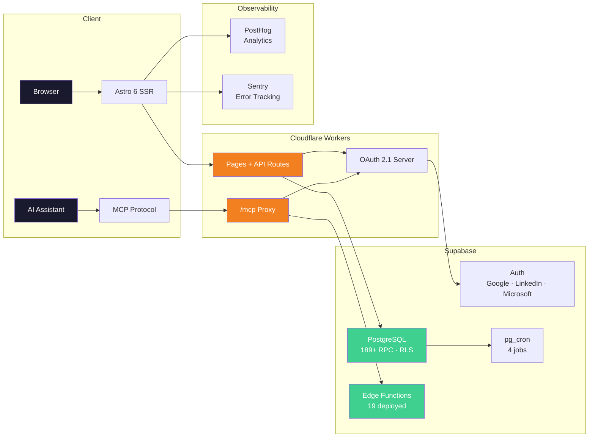
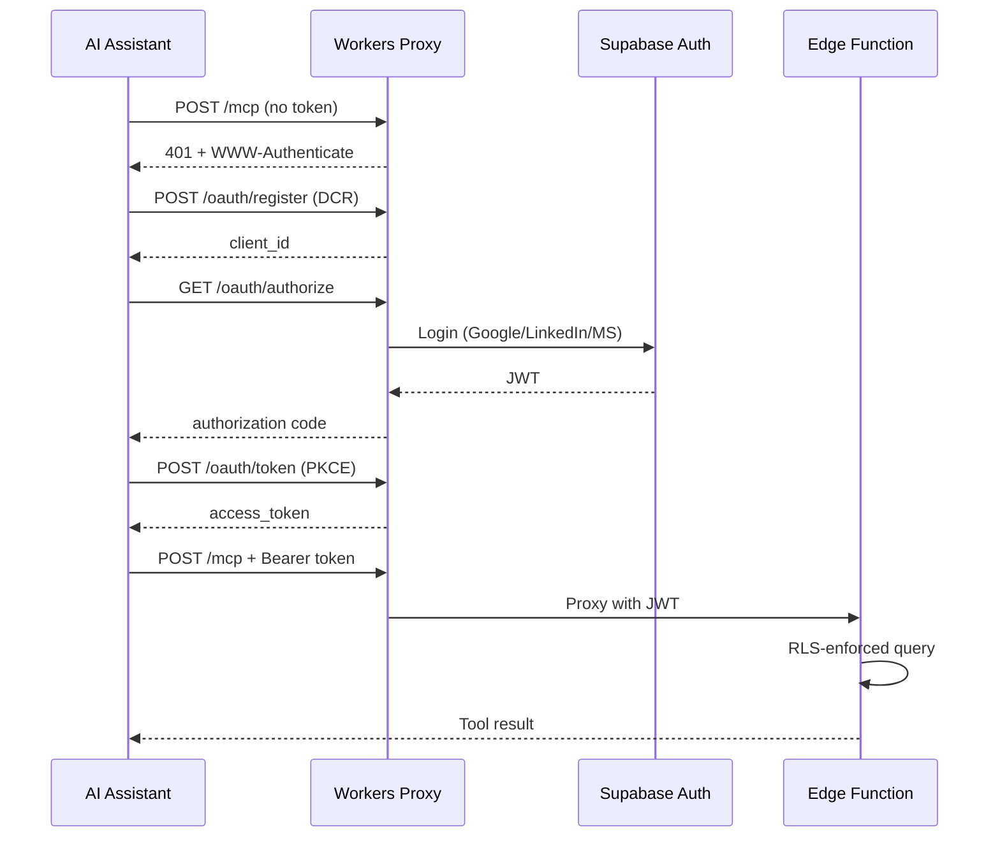

<div align="center">

# 🌐 AI & PM Research Hub

**Nucleo de Estudos e Pesquisa em Inteligencia Artificial e Gerenciamento de Projetos**
*Uma Iniciativa Conjunta dos Capitulos Brasileiros do PMI*

[](LICENSE)
[](https://creativecommons.org/licenses/by-sa/4.0/)
[](https://astro.build)
[](https://react.dev)
[](https://supabase.com)
[](https://workers.cloudflare.com)
[](#servidor-mcp--integracao-com-ia)
[](https://posthog.com)
[](https://sentry.io)
[]()

[🇺🇸 English](README.md) · [🇪🇸 Español](README.es.md)

[**Plataforma**](https://nucleoia.vitormr.dev) · [**Servidor MCP**](https://nucleoia.vitormr.dev/mcp) · [**Blog**](https://nucleoia.vitormr.dev/blog) · [**Governanca**](docs/GOVERNANCE_CHANGELOG.md)

</div>

---

## Visao Geral

O **AI & PM Research Hub** (*Nucleo de Estudos e Pesquisa em Inteligencia Artificial e Gerenciamento de Projetos*) e uma iniciativa multi-capitulo de pesquisa sob o ecossistema PMI® brasileiro, dedicada a avancar a intersecao entre Inteligencia Artificial e Gerenciamento de Projetos.

Fundado em 2024 como piloto no PMI Goias, o projeto evoluiu para uma alianca estruturada entre cinco capitulos PMI — **PMI-GO, PMI-CE, PMI-DF, PMI-MG e PMI-RS** — com 50 pesquisadores ativos organizados em 7 tribos de pesquisa e 4 quadrantes estrategicos.

> **Gerente de Projeto:** Vitor Maia Rodovalho

---

## Numeros Atuais

| Indicador | Valor |
|-----------|-------|
| Pesquisadores ativos (Ciclo 3) | 50 |
| Tribos de pesquisa | 7 |
| Capitulos PMI | 5 (GO · CE · DF · MG · RS) |
| Entradas de governanca | 135+ |
| Posts no blog | 9 |
| Ferramentas MCP | 29 (23 leitura · 6 escrita) |
| Edge Functions | 19 |
| Chaves i18n | 3.500+ (3 idiomas) |
| Testes | 779 |
| Custo mensal | $0 |

---

## Quadrantes Estrategicos

| # | Quadrante | Tribos de Pesquisa |
|---|----------|-----------------|
| Q1 | **O Praticante Aumentado** | Ferramentas e Ecossistema de IA para GP |
| Q2 | **Gestao de Projetos com IA** | Agentes Autonomos e Equipes Hibridas |
| Q3 | **Lideranca Organizacional** | TMO e PMO do Futuro · Cultura e Mudanca · Talentos e Capacitacao · ROI e Portfolio |
| Q4 | **Futuro e Responsabilidade** | Governanca e IA Confiavel · Inclusao e Colaboracao Humano-IA |

---

## Arquitetura



---

## Stack Tecnica

| Camada | Tecnologia | Detalhes |
|--------|-----------|---------|
| **Frontend** | Astro 6 + React 19 + Tailwind 4 | SSR com island architecture, trilingue |
| **Hospedagem** | Cloudflare Workers | SSR na edge, proxy OAuth, proxy MCP |
| **Banco de Dados** | Supabase PostgreSQL | 189+ funcoes SECURITY DEFINER, RLS |
| **Auth** | Google + LinkedIn + Microsoft | OAuth 2.1, PKCE, registro dinamico de clientes |
| **MCP** | Servidor customizado (42 ferramentas) | Assistentes de IA consultam a plataforma via linguagem natural |
| **Logica Server** | Supabase Edge Functions (19) | Sync Credly, presenca, MCP, campanhas, PostHog proxy |
| **Analytics** | PostHog | Analytics de produto, session replay |
| **Erros** | Sentry | Monitoramento de erros em tempo real |
| **Cron** | pg_cron (4 jobs) | Sync Credly, presenca, alertas detratores, lembretes |
| **DnD** | @dnd-kit | BoardEngine Kanban |
| **Rich Text** | TipTap | Atas de reuniao, editor de blog |

---

## Servidor MCP — Integracao com IA

Qualquer membro pode conectar Claude, ChatGPT, Perplexity, Cursor ou VS Code a plataforma via Model Context Protocol. 42 ferramentas (36 leitura + 6 escrita) autenticadas via OAuth 2.1 com Row Level Security. Auto-refresh server-side mantem sessoes ativas por ate 30 dias sem reconexao manual. Camada de conhecimento dinamica adapta orientacoes ao papel e permissoes de cada membro.

```
https://nucleoia.vitormr.dev/mcp
```



| Compatibilidade | Status |
|----------------|--------|
| Claude.ai | Verificado (42 ferramentas) |
| Claude Code | Verificado |
| ChatGPT | Verificado (beta) |
| Perplexity | Verificado |
| Cursor / VS Code | Verificado |
| Manus AI | Verificado (JSON import) |

**[Guia de Configuracao MCP](docs/MCP_SETUP_GUIDE.md)**

---

## Funcionalidades

### Para Pesquisadores
- Workspace pessoal com XP, ranking e rastreamento de badges Credly
- Dashboard da tribo com reunioes, presenca e entregas
- BoardEngine (Kanban, tabela, calendario, timeline, visualizacao agrupada)
- Gamificacao com 10 categorias de XP
- Interface trilingue (PT-BR · EN-US · ES-LATAM)

### Para Lideres de Tribo
- Gestao completa do board (criar, atribuir, mover, arquivar)
- Registro e relatorios de presenca
- Atas de reuniao (editor rich text TipTap)
- Notificacoes e broadcast para a tribo

### Para Administracao
- Painel admin com dashboards de KPI e governanca
- 28+ Change Requests rastreando atualizacoes manuais
- Landing page para stakeholders
- Processo seletivo com revisao cega
- CRUD de sustentabilidade com projecoes financeiras

---

## Governanca

Este projeto opera sob um modelo formal de governanca com niveis hierarquicos de acesso, um comite de revisao por pares (*Comite de Curadoria*), e processos seletivos baseados em merito. Todas as decisoes sao rastreadas no changelog.

- [Changelog de Governanca](docs/GOVERNANCE_CHANGELOG.md) — 135+ entradas (GC-001 a GC-135+)
- [Board de Sprints](https://github.com/users/VitorMRodovalho/projects/1/)
- [Guia de Contribuicao](CONTRIBUTING.md)

---

## Principios de Arquitetura

1. **Custo Zero, Alto Valor** — Toda a infraestrutura em free tiers (Supabase, Cloudflare, PostHog, Sentry)
2. **Plataforma como Fonte da Verdade** — Estado dos membros, gamificacao, governanca e producoes de pesquisa vivem aqui
3. **Seguranca por Design** — Todas as escritas via RPCs SECURITY DEFINER, RLS por membro/tribo/role, conformidade LGPD
4. **Centralizacao de Dados** — Agendas, links, slots de reuniao no banco de dados — nunca hardcoded

---

## Desenvolvimento Local

```bash
npm install
npm run build
npm run dev -- --host 0.0.0.0 --port 4321
npm test
```

**Pre-requisitos:** Node.js 24+ (nvm), Supabase CLI, Wrangler CLI. Veja `.env.example` para variaveis.

---

## Estrutura do Repositorio

```
├── src/
│   ├── pages/          # Paginas Astro (rotas trilingues)
│   ├── components/     # React islands + componentes Astro
│   ├── lib/            # Cliente Supabase, auth, utilitarios
│   └── middleware/      # CSP, auth, i18n
├── supabase/
│   ├── functions/      # 19 Edge Functions
│   └── migrations/     # Migracoes do banco de dados
├── tests/              # 779 testes passando
├── docs/               # Governanca, guias, specs
└── scripts/            # Scripts de auditoria e utilitarios
```

---

## Documentacao

| Documento | Proposito |
|----------|---------|
| [`README.md`](README.md) | Ponto de entrada do projeto (EN) |
| [`README.pt-BR.md`](README.pt-BR.md) | Versao em Portugues |
| [`README.es.md`](README.es.md) | Version en Espanol |
| [`CONTRIBUTING.md`](CONTRIBUTING.md) | Como contribuir |
| [`AGENTS.md`](AGENTS.md) | Contexto para assistentes de IA |
| [`docs/GOVERNANCE_CHANGELOG.md`](docs/GOVERNANCE_CHANGELOG.md) | Todas as decisoes de governanca |
| [`docs/MCP_SETUP_GUIDE.md`](docs/MCP_SETUP_GUIDE.md) | Configuracao do servidor MCP |
| [`docs/BOARD_ENGINE_SPEC.md`](docs/BOARD_ENGINE_SPEC.md) | Arquitetura do BoardEngine |
| [`docs/DISASTER_RECOVERY.md`](docs/DISASTER_RECOVERY.md) | Backup e recuperacao |

---

## Licenca

Codigo licenciado sob [MIT](LICENSE).
Documentacao licenciada sob [CC BY-SA 4.0](https://creativecommons.org/licenses/by-sa/4.0/).

PMI®, PMBOK®, PMP® e PMI-CPMAI™ sao marcas registradas do Project Management Institute, Inc.
Esta iniciativa e um projeto colaborativo de capitulos PMI independentes e nao e diretamente afiliada ou endossada pelo PMI Global.
