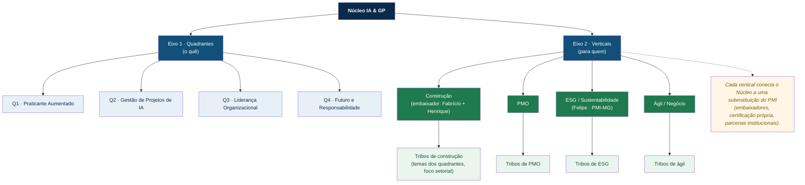

# HANDOFF → ai-pm-research-hub: Iniciativa "Kickoff Ciclo 4 + Onboarding dos Líderes"

**De:** nó PMO (~/projects) · **Para:** sessão do projeto `ai-pm-research-hub`
**Data:** 2026-07-04 · **Evento alvo:** 9 de julho de 2026 (encerramento Ciclo 3 + abertura Ciclo 4)
**Objetivo do handoff:** criar a iniciativa no hub, com Fabrício como líder e Fernando Maquiaveli como coordenador, e engajar todos os líderes (atuais e novos) nas ações abaixo.

> ⚠️ **Localização dos insumos:** estes arquivos vivem no **nó PMO (Pai)**, não no repo do hub.
> Caminho absoluto (use este ao referenciar de dentro da sessão do hub, cujo cwd é `~/projects/ai-pm-research-hub`):
> - `/home/vitormrodovalho/projects/_pmo/youtube/cycle4-assets/ROTEIRO-kickoff-ciclo4.md` — run-of-show do evento.
> - `/home/vitormrodovalho/projects/_pmo/youtube/cycle4-assets/GUIA-videos-tribo-e-boas-praticas-ciclo4.md` — template do vídeo + gaps do site + boas práticas.
> - `/home/vitormrodovalho/projects/_pmo/youtube/cycle4-assets/SCRIPT-tribo06-fabricio-EXEMPLO.md` — exemplo de vídeo pronto de gravar.
> - `/home/vitormrodovalho/projects/_pmo/youtube/cycle4-assets/verticais.png` — diagrama das verticais renderizado.
>
> Se preferir versionar esses artefatos junto do projeto, copie a pasta para dentro do hub (ex.: `~/projects/ai-pm-research-hub/docs/kickoff-ciclo4/`) e ajuste as referências para relativas.

---

## 1. Iniciativa a criar

- **Nome:** Kickoff Ciclo 4 + Onboarding dos Líderes
- **Tipo:** iniciativa transversal (não é tribo temática)
- **Líder:** **Fabrício Costa**
- **Coordenador:** **Fernando Maquiaveli**
- **Janela:** 04/07 a 11/07/2026 (pré-evento → evento 09/07 → onboarding pós-evento)
- **Drive/artefatos:** vincular à pasta do Ciclo 4 (`link_initiative_to_drive`)

### Roster de envolvidos (líderes atuais + novos)

**Líderes de tribo atuais (Ciclo 3):**
| Tribo | Líder | Situação p/ Ciclo 4 |
|---|---|---|
| T1 Radar Tecnológico | Hayala Curto | mantém; revisar datas |
| T2 Agentes & Equipes Híbridas | **em transição** (Débora Moura passa o bastão) | **novo líder precisa gravar vídeo** |
| ~~T3 TMO/PMO do Futuro~~ | ~~Marcel Fleming~~ | **DESCONTINUADA** — Marcel pediu desligamento ao longo do Ciclo 3 (offboard). Não entra no Ciclo 4. (Por isso está ausente da seleção no site: correto, não é bug.) |
| T4 Cultura & Change | Fernando Maquiaveli | mantém (e vira coordenador da iniciativa) |
| T5 Talentos & Upskilling | Jefferson Pinto | ajuste de âmbito (power skills) → regravar vídeo |
| T6 ROI & Portfólio | Fabrício Costa | mantém (e vira líder da iniciativa) |
| T7 Governança & Trustworthy AI | Marcos Klemz | mantém; tribo desfalcada, precisa de gente |
| T8 Inclusão & Colaboração | Ana Carla Cavalcante | mantém; revisar datas |

**Novos líderes / embaixadores de vertical entrando (Ciclo 4):**
> O Núcleo já tem os nomes corretos e o acesso desses novos líderes na plataforma. Grafias abaixo são referência (da reunião de 25/06); use `search_members` para puxar o registro oficial ao engajar.
| Vertical | Líder | 
|---|---|
| Construção | Henrique Diniz (+ 2 embaixadores LATAM) |
| PMO | Messias |
| Ágil / Negócio | Jonathá |
| ESG / Sustentabilidade | Felipe (PMI Minas Gerais) |

---

## 2. Ações da iniciativa (atividade · responsável · data baseline)

Registrar cada linha como card/action item, com **responsável e data baseline**, e marcar quando concluída (padrão da Parte C do guia). Baseline abaixo; repactuar forecast conforme andar.

### Frente 1 — Condução do evento (09/07)
| # | Atividade | Responsável | Baseline |
|---|---|---|---|
| 1.1 | Fechar run-of-show (usar `ROTEIRO-kickoff-ciclo4.md`) | Fabrício + Vitor | 07/07 |
| 1.2 | Preparar bloco "Verticais" + diagrama (seção 4) | Fabrício | 08/07 |
| 1.3 | Confirmar falas das diretorias (GO/CE/DF/MG/RS) | Vitor | 07/07 |
| 1.4 | Kit de boas-vindas do buddy ("7 primeiros dias") | Fernando (coord.) | 08/07 |

### Frente 2 — Vídeos de boas-vindas das tribos (template da Parte A)
Detalhe operacional (brief + 1 tarefa por líder + destino Drive) na **seção 6** abaixo.
| # | Atividade | Responsável | Baseline |
|---|---|---|---|
| 2.1 | Gravar/atualizar vídeo (4-6 min, template) e subir no Drive | **cada líder de tribo** (ver seção 6) | 08/07 |
| 2.2 | Prioridade de regravação: T2 (novo líder), T5 (ajuste de âmbito), tribos com datas alteradas | líderes T2/T5/T6 | 08/07 |
| 2.3 | Vídeos dos novos líderes de vertical | Henrique/Messias/Jonathá/Felipe | 08/07 |
| 2.4 | Revisão de padrão (duração, lower third, áudio) antes de subir | Fernando (coord.) | 08/07 |

### Frente 3 — Correções do site (gaps da Parte B) — antes do kickoff
| # | Atividade | Responsável | Baseline |
|---|---|---|---|
| 3.1 | Ajustar teto por tribo no site para **7** (era "10") | Vitor / plataforma | 07/07 |
| 3.2 | Confirmar remoção da Tribo 03 do site (Marcel desligado — correto) e realocar interessados | plataforma | 07/07 |
| 3.3 | Alinhar cadências divergentes (T2 8h30×20h30; T6 "a definir") | líderes T2/T6 | 07/07 |
| 3.4 | Desdobrar verticais na home + publicar diagrama | plataforma + Fabrício | 08/07 |
| 3.5 | Data única de seleção (site = vídeo = fala) | Vitor | 07/07 |
| 3.6 | Ligar números da home ao dado vivo do MCP | plataforma | 08/07 |
> Estas 6 linhas = conteúdo do **[LL]** da seção 4 abaixo.

### Frente 4 — Onboarding dos líderes + governança (Parte C)
| # | Atividade | Responsável | Baseline |
|---|---|---|---|
| 4.1 | Registrar roadmap da tribo com baseline + forecast (cards) | cada líder | 11/07 |
| 4.2 | Publicar cadência semanal fixa (dia+hora) por tribo | cada líder | 09/07 |
| 4.3 | Definir pares Team Buddy p/ ~40 novos | Fernando (coord.) | 09/07 |
| 4.4 | Rodar toda reunião com ata + action items (responsável+prazo) | cada líder | recorrente |

---

## 3. Como criar no hub (passo a passo com MCP)

Executar de dentro da sessão `ai-pm-research-hub` (onde os schemas MCP carregam):

1. **Criar a iniciativa** pelo fluxo de iniciativa do hub (UI/plataforma). Definir Fabrício como líder.
2. **Engajar o coordenador e os líderes:** `invite_to_initiative` / `manage_initiative_engagement` para Fernando (coordenador) e cada líder do roster (seção 1). Confirmar novos nomes com `search_members` antes.
3. **Vincular Drive:** `link_initiative_to_drive` (pasta do Ciclo 4).
4. **Criar as ações** (seção 2) como action items com responsável + data: `create_action_item` (ou cards em board da iniciativa via `create_board_card` + `update_card_forecast` para baseline/forecast).
5. **Acompanhamento:** `list_initiative_engagements`, `list_meeting_action_items`, `get_my_board_status`; marcar concluído com `resolve_action_item` / `complete_checklist_item`.
6. **Reuniões do onboarding:** `get_meeting_preparation` → `register_attendance` → `create_meeting_notes` → `create_action_item` → `meeting_close`.

> Nota de governança: criação de iniciativa e convites são ações reais e externas. Rodar de dentro do hub, com Vitor confirmando o roster antes de disparar convites.

---

## 4. [LL] — JÁ REGISTRADO ✅

Postado como comentário na issue de intake padrão do hub: **VitorMRodovalho/ai-pm-research-hub#588** (`[LL] Lessons-learned intake → portfolio PMO`) → https://github.com/VitorMRodovalho/ai-pm-research-hub/issues/588#issuecomment-4883042240
As correções operacionais do site viram ações da iniciativa (Frente 3), não itens de harvest. Conteúdo abaixo mantido para referência.

**Título:** `[LL] Kickoff Ciclo 4 — padronização dos vídeos de tribo + boas práticas de registro`

**Corpo:**
```
Contexto: preparação do Kickoff Ciclo 4 (09/07). Auditoria da home + playlist de tribos
apontou inconsistências a corrigir antes do evento e um padrão a adotar para os vídeos.

## Gaps do site (corrigir antes de 09/07)
- [ ] Teto por tribo: ajustar home de "Máx. 10" para **7** (decisão da liderança).
- [ ] Tribo 03 (TMO/PMO, Marcel) fora do Ciclo 4: Marcel pediu desligamento no C3. Ausência da seleção está correta; confirmar realocação de eventuais interessados.
- [ ] Cadência da Tribo 02 divergente: vídeo diz qui 8h30, site diz qui 20h30.
- [ ] Tribo 06 com cadência "A definir com o time" — precisa de dia+hora.
- [ ] Verticais (construção/PMO/ESG/ágil) ainda finas na home; desdobrar + publicar diagrama.
- [ ] Números da home em placeholder ("—") enquanto o MCP já tem os vivos; ligar ao dado real.
- [ ] Data de seleção única e coerente entre site, vídeos e fala do kickoff (site diz 17/jul).
- [ ] Status "Ciclo 3 em Andamento" durante seleção da próxima coorte → "Ciclo 3 encerrando · Ciclo 4 abrindo".

## Padrão de vídeo de boas-vindas de tribo (lição das 8 gravações do C3)
- Duração alvo 4-6 min (C3 variou de 2 a 13 min).
- Lower third padrão: Quadrante · Vertical · Tribo NN — Nome | Líder.
- Beat obrigatório de governança: cadência fixa + carga 4-6h + "tarefa vira atividade com
  responsável e data, marcada quando entregue".
- Evergreen na narração; datas/cadência num card regravável.
- CTA concreto ("Escolher a Tribo NN até <janela>"), não "entre em contato".
- Template completo: _pmo/youtube/cycle4-assets/GUIA-videos-tribo-e-boas-praticas-ciclo4.md
```

---

## 5. Diagrama das Verticais (para a home e o bloco do kickoff)

Fonte Mermaid (renderiza no GitHub e na maioria dos viewers). Ideia: dois eixos que se cruzam. Quadrantes = **o quê**; Verticais = **para quem**. Uma vertical agrupa tribos que puxam temas dos quadrantes, focados num setor.



> Nomes/embaixadores por vertical: o Núcleo já tem os registros oficiais na plataforma.

---

## 6. Vídeos das tribos — brief simples + 1 tarefa por líder + Drive

**Como funciona:** cada líder recebe **uma tarefa no board da iniciativa do Kickoff**, atrelada a ele, cuja entrega é **gravar o vídeo e subir na pasta Drive temporária**. O brief (passos/recomendações do que o vídeo precisa ter) é o mesmo para todos e vira a **descrição do card**.

- **Brief (colar como descrição do card):** `/home/vitormrodovalho/projects/_pmo/youtube/cycle4-assets/BRIEF-video-tribo.md`
- **Exemplo pronto (referência):** `SCRIPT-tribo06-fabricio-EXEMPLO.md`
- **Pasta Drive temporária (upload dos vídeos):** https://drive.google.com/drive/folders/1T1ATHvJ-G3Tk7D05QoHALvfk15bTNG2m
- **Convenção de nome do arquivo:** `TriboNN-Tema-Nome.mp4` (vertical: `Vertical-Tema-Nome.mp4`)

### Tarefas (uma por líder) — board da iniciativa

| Card | Responsável | Tribo/Vertical | Nome do arquivo | Baseline |
|---|---|---|---|---|
| Gravar vídeo de boas-vindas | Hayala Curto | T1 · Radar Tecnológico | `T01-Radar-Hayala.mp4` | 08/07 |
| Gravar vídeo de boas-vindas | *novo líder da T2* | T2 · Agentes & Equipes Híbridas | `T02-Agentes-<nome>.mp4` | 08/07 |
| Gravar vídeo de boas-vindas | Fernando Maquiaveli | T4 · Cultura & Change | `T04-Cultura-Fernando.mp4` | 08/07 |
| Gravar vídeo de boas-vindas | Jefferson Pinto | T5 · Talentos & Upskilling | `T05-Talentos-Jefferson.mp4` | 08/07 |
| Gravar vídeo de boas-vindas | Fabrício Costa | T6 · ROI & Portfólio | `T06-ROI-Fabricio.mp4` | 08/07 |
| Gravar vídeo de boas-vindas | Marcos Klemz | T7 · Governança & Trustworthy AI | `T07-Governanca-Marcos.mp4` | 08/07 |
| Gravar vídeo de boas-vindas | Ana Carla Cavalcante | T8 · Inclusão & Colaboração | `T08-Inclusao-AnaCarla.mp4` | 08/07 |
| Gravar vídeo de boas-vindas | Henrique Diniz | Vertical · Construção | `Vertical-Construcao-Henrique.mp4` | 08/07 |
| Gravar vídeo de boas-vindas | Messias | Vertical · PMO | `Vertical-PMO-Messias.mp4` | 08/07 |
| Gravar vídeo de boas-vindas | Jonathá | Vertical · Ágil/Negócio | `Vertical-Agil-Jonatha.mp4` | 08/07 |
| Gravar vídeo de boas-vindas | Felipe (PMI-MG) | Vertical · ESG | `Vertical-ESG-Felipe.mp4` | 08/07 |

> T3 (Marcel) não entra: desligamento no Ciclo 3.

### Wiring no hub (MCP)
1. Criar o board da iniciativa (ou usar o board do Kickoff) e **vincular à pasta Drive**: `link_board_to_drive` (folder `1T1ATHvJ-G3Tk7D05QoHALvfk15bTNG2m`) → uploads viram descoberta automática.
2. Um card por linha da tabela: `create_board_card` + `update_card_fields` (responsável = líder, due = 08/07, descrição = conteúdo do `BRIEF-video-tribo.md`).
3. Quando o líder subir o MP4: `register_card_drive_file` / `list_card_drive_files` para anexar o vídeo ao card; líder marca concluído (`update_card_status`).
4. Acompanhamento do lote: `list_board_cards` / `get_board_drive_links`.
